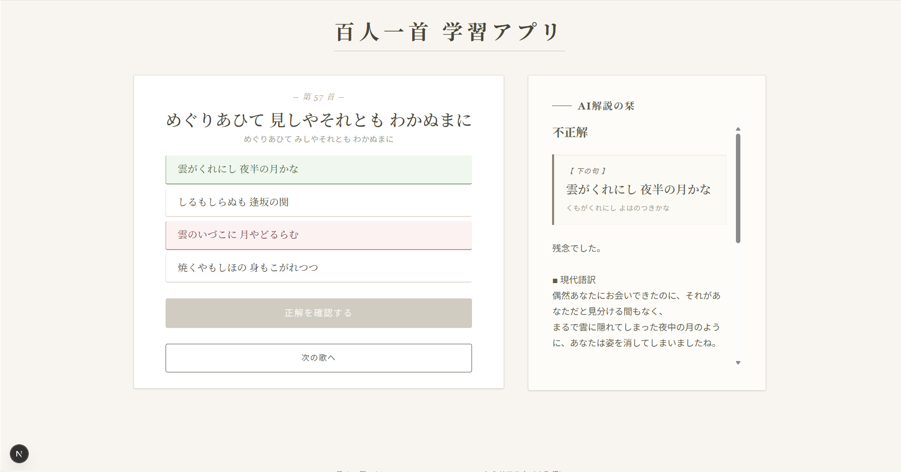
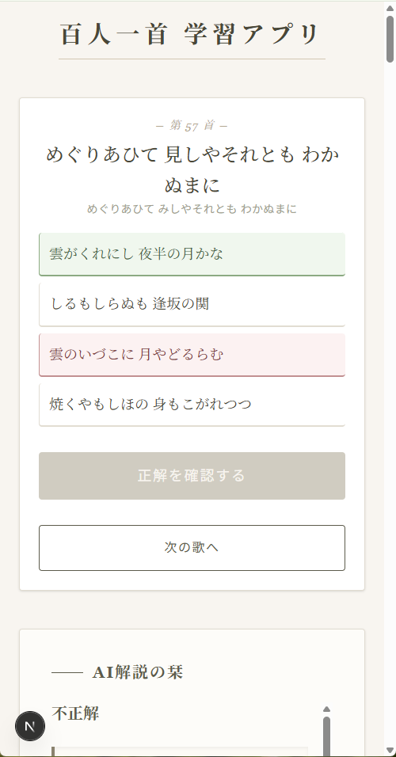
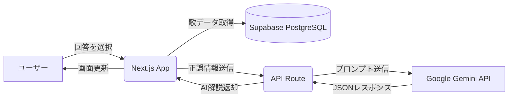

# AI百人一首 学習アプリ（Next.js / Supabase / Gemini API）

  
  
   
  <em>▲ PC・スマホの両デバイスに対応したレスポンシブデザイン</em>

## デモ

ブラウザから実際に操作できます。

🔗 https://ai-hyakunin-isshu-react.vercel.app/

## 概要

出題された百人一首の「上の句」から、  
正しい「下の句」を4択形式で選択する学習アプリです。

Next.js + Supabase + Google Gemini API を利用して制作しました。

## 開発背景

百人一首は、平安時代の文化や情感が凝縮された古典文学です。  
しかし実際に学ぼうとすると、

- 意味が分かりづらい
- 暗記量が多い
- 継続学習が難しい

といった課題があると感じていました。

そこで本アプリでは、生成AIを単なるチャット用途ではなく、  
「学習を補助するUI」として活用することをテーマに設計しています。

解答後に、

- 現代語訳
- 歌の背景
- 掛詞や縁語

などを即時表示することで、単なる暗記ではなく、

**「時代背景への理解を通じた学習体験」**

を目指しました。

また、ポートフォリオとして長期公開することを前提に、著作権や利用制約も考慮した上で、  
古典文学である百人一首を題材として採用しています。

## 主な実装ポイント

- **AI解説機能**

  Google Gemini API を利用し、回答結果に応じた学習向け解説を生成しています。

  また、出力形式をJSONに限定することで、AI特有の不安定なレスポンスへ対応しています。

- **保守性を意識した状態管理**

  React Hooks（useState / useEffect）を利用し、

  - 問題表示
  - 回答状態
  - AI通信状態

  を分離管理しています。

- **エラーハンドリング**

  以下のケースを考慮しています。

  - API通信失敗
  - Gemini API制限（429）
  - AIレスポンス不正JSON
  - Supabase取得失敗

## データフロー（処理の流れ）

ユーザーが操作した際に、システム内部でどのような処理が行われるかを図解しています。

## システム構成

| 構成 | 役割 |
|---|---|
| Next.js / Vercel | UI表示・状態管理・API通信 |
| Supabase / PostgreSQL | 百人一首データ管理 |
| Google Gemini API | AI解説生成 |
| API Route | Gemini APIとの安全な通信 |

## 外部接続

Gemini APIとの通信は、Next.js API Route を経由して実装しています。

Google Gemini API のAPIキーは、Vercel の Environment Variables を利用して安全に管理しています。

また、API Route を介することで、APIキーをクライアント側へ公開しない構成を採用しています。

## 使用技術

### Frontend

- Next.js 15
- React
- TypeScript
- Tailwind CSS

### Backend / API

- Next.js Route Handler
- Google Gemini API

### Database

- Supabase
- PostgreSQL

## 工夫した点・苦労した点

Gemini API は出力形式が不安定になる場合があるため、  
JSON形式を指定し、正規表現を用いて安全に抽出する処理を実装しました。

また、429エラーや通信失敗時のユーザー体験を考慮し、
フォールバックメッセージを表示しています。